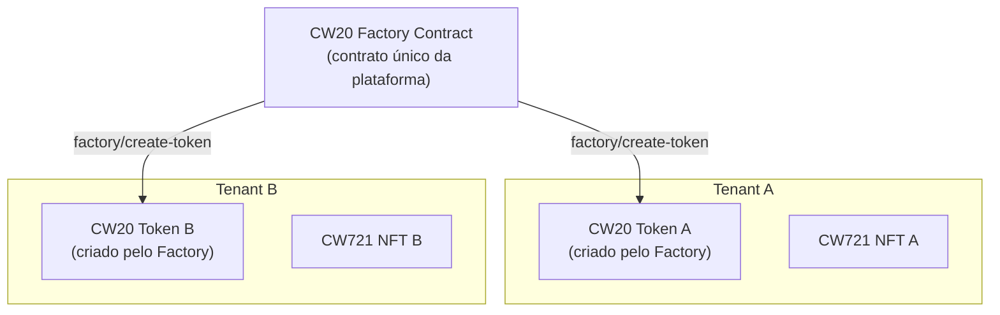
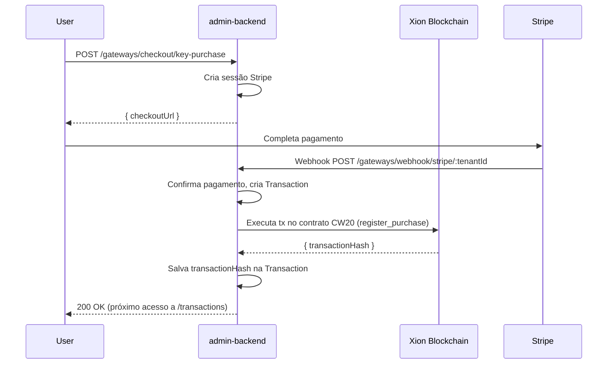

# Blockchain — Xion

O MKClub usa a blockchain **Xion** (rede Cosmos) para registrar propriedade de NFTs e tokens de utilidade.

## Contratos inteligentes

| Contrato | Padrão | Função |
|----------|--------|--------|
| **CW721** | NFT | Representa as "chaves" (keys) como NFTs na blockchain |
| **CW20** | Token fungível | Token de utilidade por tenant |
| **CW20 Factory** | Factory | Contrato mestre que cria CW20 isolados por tenant |

## Arquitetura multi-tenant na blockchain



## Fluxo de compra registrado na blockchain



## Endpoints do módulo Xion

### Health e informações
- `GET /xion/health` — Status da conexão com a blockchain
- `GET /xion/address` — Endereço da wallet admin

### Factory (multi-tenant)
- `POST /xion/factory/deploy` — Deploy do contrato Factory (uma vez só, SuperAdmin)
- `POST /xion/factory/create-token` — Cria CW20 para um novo tenant
- `GET /xion/factory/tenant-token` — Retorna o endereço CW20 de um tenant
- `GET /xion/factory/tenants` — Lista todos os tenants registrados na Factory
- `GET /xion/factory/token-count` — Total de tokens deployados

### Tenant-scoped
- `POST /xion/tenant/mint` — Mint de NFT para um tenant
- `POST /xion/tenant/purchases/register` — Registra compra no contrato CW20 do tenant

### Legacy (single-tenant)
- `POST /xion/mint` — Mint NFT (legado)
- `POST /xion/deploy` — Deploy de contrato NFT (legado)
- `POST /xion/purchases/register` — Registro de compra (legado)

## Configuração de ambiente

```bash
# admin-backend/.env.blockchain
XION_MNEMONIC=sua frase mnemonica de 24 palavras bip39
XION_RPC_URL=https://rpc.xion-testnet-2.burnt.com:443
XION_CHAIN_ID=xion-testnet-2

# Endereços dos contratos (preenchidos após deploy)
XION_NFT_CONTRACT=xion1...
XION_CW20_CONTRACT=xion1...
XION_FACTORY_CONTRACT=xion1...

# Arquivos WASM (usados no deploy dos contratos)
XION_NFT_WASM_PATH=blockchain/wasm/cw721_base.wasm
XION_CW20_WASM_PATH=blockchain/wasm/cw20_base.wasm
XION_FACTORY_WASM_PATH=blockchain/wasm/cw20_factory.wasm
```

:::info Testnet
O ambiente de desenvolvimento usa a Xion testnet-2. Para produção, atualize `XION_RPC_URL` e `XION_CHAIN_ID` para a mainnet.
:::

:::tip Falha de conexão graceful
Se a blockchain não estiver acessível na inicialização do serviço, o `XionService` loga um warning e continua. Os endpoints de blockchain retornarão erro 503 se chamados sem conexão estabelecida.
:::
