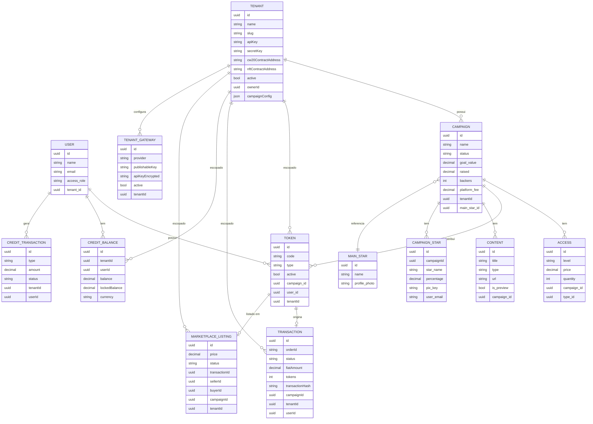

# Entidades e Relacionamentos

## Modelo de dados simplificado

## Descrição das entidades

### Tenant

Representa um cliente B2B da plataforma. Cada tenant tem:
- Chaves de API (`apiKey` + `secretKey`) para integrações externas
- Contratos CW20 e NFT na blockchain Xion (opcionais)
- Configuração de campanhas (`campaignConfig` JSON)
- Um `ownerId` (usuário Admin ou SuperAdmin responsável)

### User

Usuário autenticado. O mesmo usuário pode ter diferentes `access_role`s e `tenant_id`s dependendo do contexto.

| Role | tenant_id | Acesso |
|------|-----------|--------|
| SuperAdmin | null | Total — todos os tenants |
| Admin | null | Todos os tenants que ele criou |
| TenantAdmin | uuid | Apenas o próprio tenant |
| User | uuid | Apenas endpoints de usuário final |
| Star | uuid | Acesso a splits e campanhas associadas |

### Campaign

Campanha de crowdfunding criativa. Cada campanha:
- Pertence a um **Tenant**
- Tem um **MainStar** (artista principal)
- Pode ter múltiplas **CampaignStars** (artistas colaboradores com percentual de split)
- Define **Accesses** (tiers de acesso com preço e quantidade)
- Associa **Contents** (conteúdo exclusivo para apoiadores)

### Token

Representa uma "chave" (key) adquirida por um usuário. Após a compra:
- Fica vinculado ao `userId`
- Pode ser listado no **Marketplace** para venda
- Registrado on-chain na blockchain Xion

### Transaction

Registro de uma compra. Criada quando:
- Usuário compra via Stripe (checkout de créditos ou compra direta)
- Admin registra compra Web2 manualmente
- Compra P2P no marketplace é concluída

### Credit Balance / Credit Transaction

Sistema de créditos interno:
- `CreditBalance`: saldo atual por tenant+usuario
- `CreditTransaction`: histórico de movimentações (add, subtract, refund, lock, unlock)

### Marketplace Listing

Quando um usuário lista uma chave para venda P2P:
- Cria um `MarketplaceListing` vinculado à `Transaction` original
- Status: `active` → `sold` ou `cancelled`

### TenantGateway

Configuração do gateway de pagamento por tenant:
- Provider: `stripe`
- API key criptografada
- Cada tenant pode ter múltiplos gateways (mas apenas um ativo por provider)
