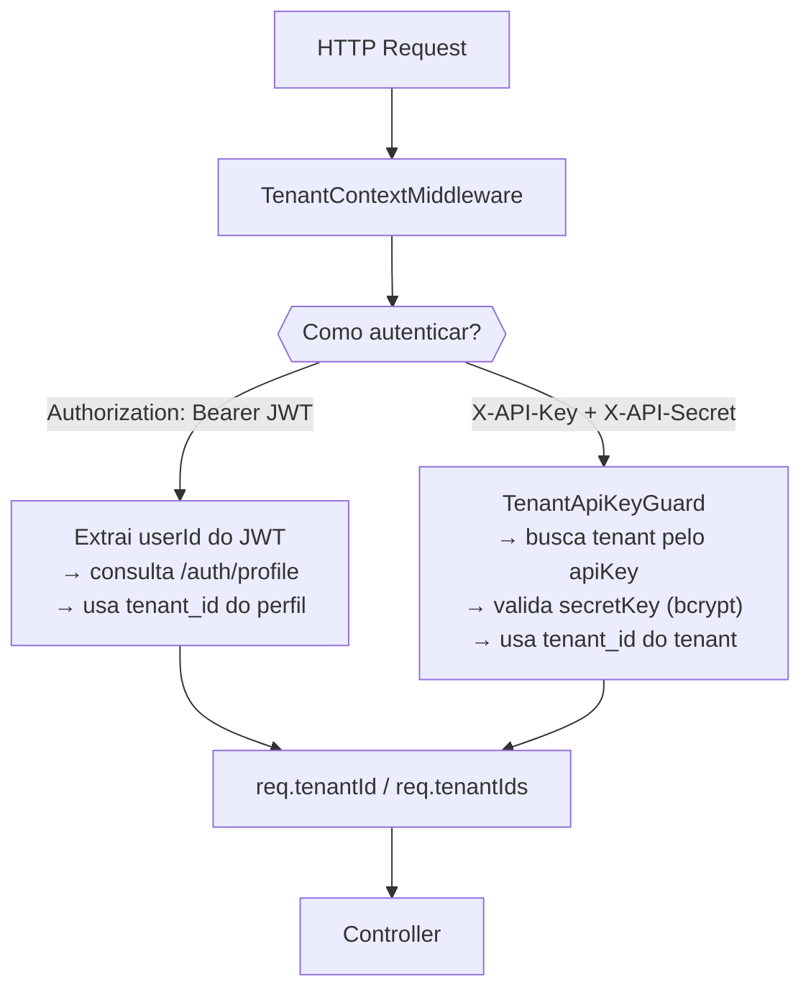
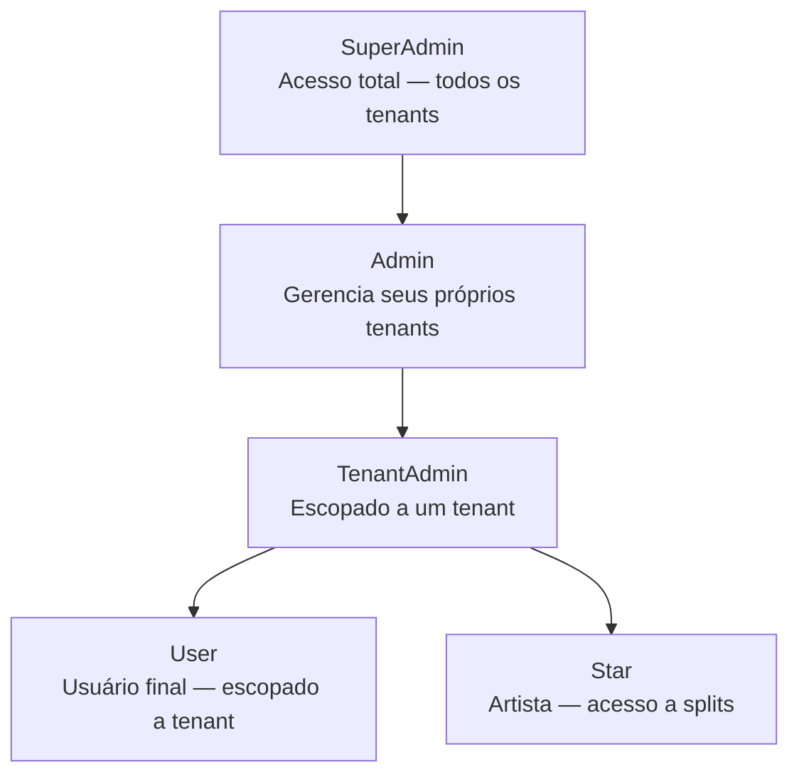

# Multi-Tenancy & Roles

O admin-backend é **totalmente multi-tenant**: uma única instância do serviço atende múltiplos clientes (tenants) de forma completamente isolada.

## Como o tenant é resolvido

Todo request passa pelo `TenantContextMiddleware` que resolve o tenant de duas formas:



## Hierarquia de roles



## Matriz de permissões por endpoint

| Recurso | SuperAdmin | Admin | TenantAdmin | User | Star |
|---------|:---:|:---:|:---:|:---:|:---:|
| Criar/listar tenants | ✅ | ✅ (próprios) | ❌ | ❌ | ❌ |
| Dashboard global | ✅ | ❌ | ❌ | ❌ | ❌ |
| Dashboard do tenant | ✅ | ✅ | ✅ | ❌ | ❌ |
| Criar campanha | ✅ | ✅ | ✅ | ✅ | ❌ |
| Listar campanhas | ✅ | ✅ | ✅ | ✅ | ✅ |
| Gerenciar usuários | ✅ | ✅ | ✅ | ❌ | ❌ |
| Conceder créditos | ✅ | ❌ | ✅ | ❌ | ❌ |
| Configurar gateway | ✅ | ❌ | ✅ | ❌ | ❌ |
| Ver splits | ✅ | ❌ | ✅ | ❌ | ✅ |
| Marketplace | ✅ | ✅ | ✅ | ✅ | ❌ |
| Deploy blockchain | ✅ | ❌ | ✅ | ❌ | ❌ |

## Isolamento de dados

O middleware injeta `tenantId` no `request`. Cada controller/service usa esse ID para filtrar dados:

```typescript
// Exemplo no CampaignsService
async findAll(tenantId: string): Promise<Campaign[]> {
  return this.campaignRepo.find({ where: { tenantId } });
}
```

Usuários **SuperAdmin** e **Admin** podem receber `tenantIds` (plural) — um array com todos os tenants que gerenciam.

## Autenticação via API Key (integrações)

Para sistemas externos que não usam JWT, o tenant pode usar suas chaves:

```http
GET /campaigns HTTP/1.1
Host: admin-api.homolog.mintvrs.com
X-API-Key: mk_live_xxxxxxxxxxxx
X-API-Secret: sk_live_yyyyyyyyyyyy
```

As chaves são geradas no momento da criação do tenant e podem ser regeneradas com `POST /tenants/:id/regenerate-keys`.

:::warning Segurança
O `secretKey` é armazenado como hash bcrypt. Nunca é retornado após a criação inicial. Se perdido, deve ser regenerado.
:::
