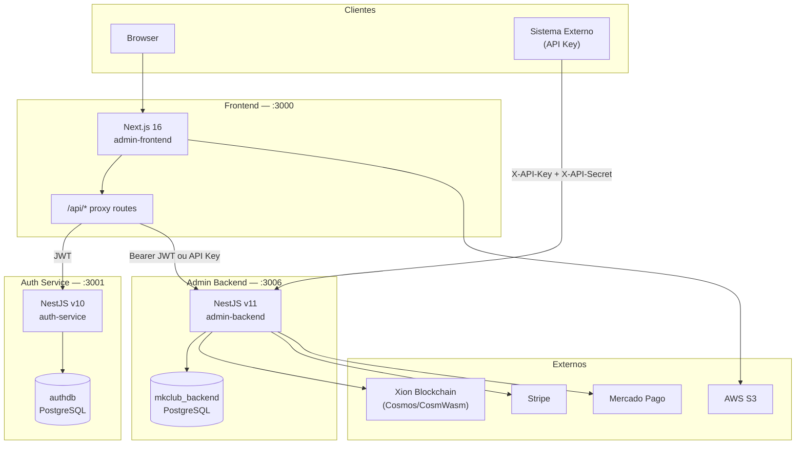
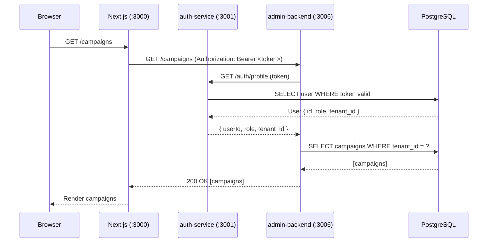

# Visão Geral do Sistema

O MKClub é composto por três serviços independentes que se comunicam via HTTP e compartilham um banco de dados PostgreSQL.

## Diagrama de arquitetura

## Responsabilidades de cada serviço

### auth-service (porta 3001)

Serviço dedicado à **autenticação e identidade**:
- Login com email/senha (Passport Local)
- Emissão e validação de JWT (access token + refresh token)
- Registro de usuários
- Reset de senha por email (Nodemailer)
- Gestão de usuários no banco `authdb`

O admin-backend **não valida JWTs diretamente** — delega para o auth-service via `GET /auth/profile`.

### admin-backend (porta 3006)

Serviço principal com **toda a lógica de negócio**:
- Multi-tenancy (cada request é escopado a um tenant)
- CRUD de campanhas, conteúdos, tokens, acessos
- Sistema de créditos e pagamentos (Stripe, Mercado Pago)
- Marketplace P2P entre usuários
- Integração com blockchain Xion (mint de NFTs, CW20)
- Splits de receita para artistas

### admin-frontend (porta 3000)

**Painel administrativo e marketplace** para clientes:
- Rota `GET /api/backend/[...path]` faz proxy para o admin-backend
- Rota `GET /api/auth/*` faz proxy para o auth-service
- Elimina problemas de CORS no browser
- Upload de conteúdo via S3 presigned URLs

## Fluxo de uma requisição autenticada

## Banco de dados

| Banco | Serviço | Tabelas principais |
|-------|---------|-------------------|
| `authdb` | auth-service | `users` |
| `mkclub_backend` | admin-backend | `tenants`, `campaigns`, `tokens`, `transactions`, `credit_balances`, `credit_transactions`, `marketplace_listings`, `accesses`, `access_types`, `main_stars`, `contents`, `campaign_stars`, `tenant_gateways`, `configs` |

Ambos os bancos rodam na mesma instância PostgreSQL (porta 5433 em dev).
