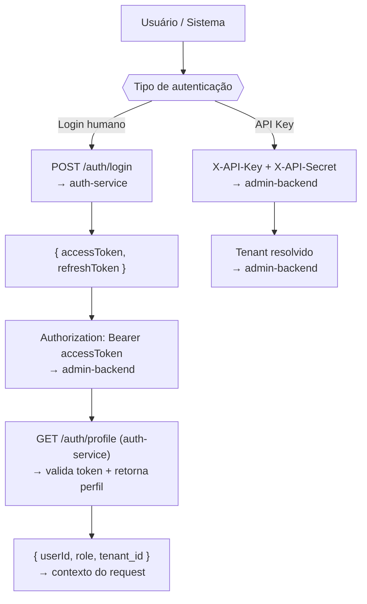

# Autenticação — Visão Geral

O MKClub usa dois mecanismos de autenticação no admin-backend:

| Mecanismo | Header | Quando usar |
|-----------|--------|-------------|
| **JWT Bearer** | `Authorization: Bearer <token>` | Usuários do painel admin e usuários finais |
| **Tenant API Key** | `X-API-Key` + `X-API-Secret` | Integrações externas (sistemas B2B) |

## Fluxo geral

## Tokens JWT

| Token | Duração | Uso |
|-------|---------|-----|
| `accessToken` | 1 hora | Enviado no header `Authorization: Bearer` |
| `refreshToken` | 7 dias | Usado em `POST /auth/refresh` para renovar |

## Endpoints de autenticação (auth-service)

| Método | Path | Descrição |
|--------|------|-----------|
| `POST` | `/auth/login` | Login email/senha |
| `POST` | `/auth/refresh` | Renovar tokens |
| `GET` | `/auth/profile` | Perfil do usuário autenticado |
| `POST` | `/auth/register` | Registrar novo usuário |
| `POST` | `/auth/password/request-reset` | Solicitar reset de senha |
| `POST` | `/auth/password/reset` | Confirmar reset com token |

Veja a [referência completa da API Auth](/api/auth-service) para todos os detalhes e o playground interativo.
