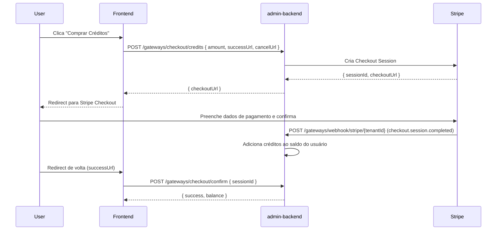

# Configurar Gateway de Pagamento

O MKClub usa **Stripe** como gateway de pagamento. Cada tenant configura seu próprio gateway.

## Provedores suportados

```bash
curl https://api.mk.nearx.com.br/gateways/providers
```

```json
["stripe"]
```

## Configurar Stripe

### 1. Registrar o gateway

```bash
curl -X POST https://api.mk.nearx.com.br/gateways \
  -H "Authorization: Bearer <token_tenantadmin>" \
  -H "Content-Type: application/json" \
  -d '{
    "provider": "stripe",
    "apiKey": "sk_live_51...",
    "publishableKey": "pk_live_51...",
    "webhookSecret": "whsec_..."
  }'
```

### 2. Configurar webhook no Stripe Dashboard

No Stripe Dashboard → Webhooks → Adicionar endpoint:
- **URL**: `https://api.mk.nearx.com.br/gateways/webhook/stripe/{tenantId}`
- **Eventos**: `checkout.session.completed`, `payment_intent.succeeded`, `payment_intent.payment_failed`

:::info
O endpoint de webhook é **público** (sem autenticação). A segurança é feita via validação da assinatura do webhook com `webhookSecret`.
:::

## Fluxo de compra de créditos via Stripe



### Criar checkout de créditos

```bash
curl -X POST https://api.mk.nearx.com.br/gateways/checkout/credits \
  -H "Authorization: Bearer <user_token>" \
  -H "Content-Type: application/json" \
  -d '{
    "amount": 10000,
    "currency": "brl",
    "successUrl": "https://minha-plataforma.com/creditos?success=true",
    "cancelUrl": "https://minha-plataforma.com/creditos?cancelled=true",
    "description": "Compra de 100 créditos"
  }'
```

:::note
`amount` é em centavos. R$ 100,00 = `10000`.
:::

### Confirmar checkout após redirecionamento

```bash
curl -X POST https://api.mk.nearx.com.br/gateways/checkout/confirm \
  -H "Authorization: Bearer <user_token>" \
  -H "Content-Type: application/json" \
  -d '{ "sessionId": "cs_live_..." }'
```

## Fluxo de compra de chave (key) via Stripe

```bash
# 1. Criar checkout para compra de chave
curl -X POST https://api.mk.nearx.com.br/gateways/checkout/key-purchase \
  -H "Authorization: Bearer <user_token>" \
  -H "Content-Type: application/json" \
  -d '{
    "campaignId": "campaign-uuid",
    "fiatAmount": 9900,
    "successUrl": "https://minha-plataforma.com/sucesso",
    "cancelUrl": "https://minha-plataforma.com/cancelado"
  }'

# 2. Após redirecionamento, confirmar compra (registra on-chain)
curl -X POST https://api.mk.nearx.com.br/gateways/checkout/confirm-key-purchase \
  -H "Authorization: Bearer <user_token>" \
  -H "Content-Type: application/json" \
  -d '{ "sessionId": "cs_live_..." }'
```

## Reembolsos

```bash
# Reembolso via gateway (Stripe)
curl -X POST https://api.mk.nearx.com.br/gateways/payments/refund \
  -H "Authorization: Bearer <token_tenantadmin>" \
  -H "Content-Type: application/json" \
  -d '{
    "providerTransactionId": "pi_...",
    "amount": 9900,
    "reason": "Solicitação do cliente"
  }'
```
