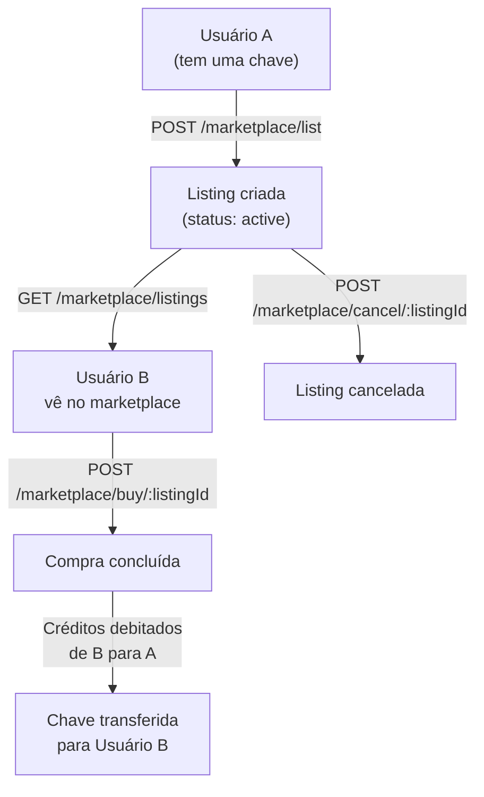
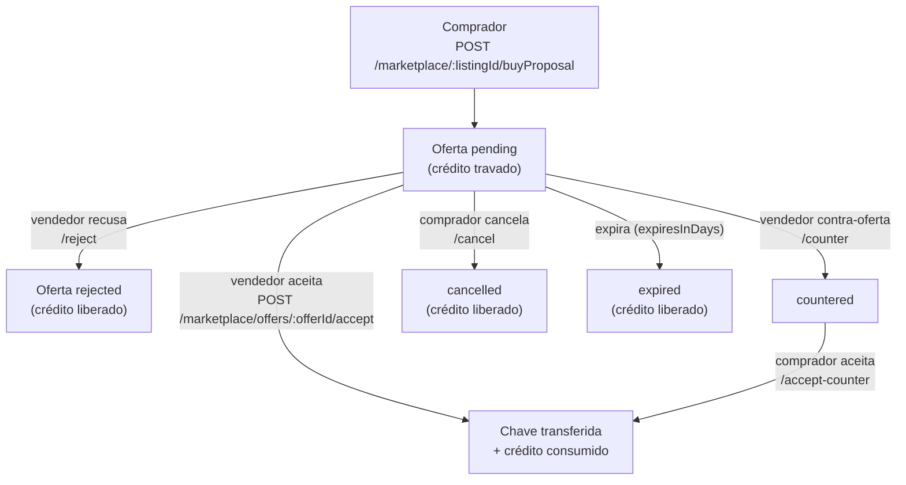

# Marketplace P2P

O marketplace permite que usuários revendam suas chaves (keys) entre si, criando um mercado secundário.

## Fluxo completo



## Listar uma chave para venda

```bash
curl -X POST https://admin-api.homolog.mintvrs.com/marketplace/list \
  -H "Authorization: Bearer <token_usuario_a>" \
  -H "Content-Type: application/json" \
  -d '{
    "transactionId": "uuid-da-transacao-original",
    "price": 7500
  }'
```

```json
{
  "id": "listing-uuid",
  "status": "active",
  "price": 7500,
  "sellerEmail": "vendedor@email.com",
  "campaignId": "campaign-uuid",
  "created_at": "2025-01-15T10:00:00Z"
}
```

:::note
`price` é em centavos. R$ 75,00 = `7500`.
O vendedor precisa ter a chave (Transaction) antes de poder listá-la.
:::

## Explorar o marketplace

```bash
# Listar todos os listings ativos
curl https://admin-api.homolog.mintvrs.com/marketplace/listings \
  -H "Authorization: Bearer <token>"

# Filtrar por campanha
curl "https://admin-api.homolog.mintvrs.com/marketplace/listings?campaignId=uuid&minPrice=5000&maxPrice=20000" \
  -H "Authorization: Bearer <token>"
```

**Parâmetros de busca:**

| Parâmetro | Tipo | Descrição |
|-----------|------|-----------|
| `search` | string | Busca por nome da campanha |
| `campaignId` | uuid | Filtrar por campanha |
| `minPrice` | number | Preço mínimo (centavos) |
| `maxPrice` | number | Preço máximo (centavos) |
| `sortBy` | string | Ordenação (`price_asc`, `price_desc`, `newest`) |

## Comprar uma chave

```bash
curl -X POST https://admin-api.homolog.mintvrs.com/marketplace/buy/{listingId} \
  -H "Authorization: Bearer <token_usuario_b>"
```

O sistema automaticamente:
1. Verifica se o comprador tem créditos suficientes
2. Debita os créditos do comprador
3. Credita o vendedor
4. Transfere a propriedade da chave
5. Marca o listing como `sold`

```json
{
  "success": true,
  "transaction": {
    "id": "nova-transaction-uuid",
    "buyerEmail": "comprador@email.com",
    "price": 7500
  }
}
```

## Gerenciar meus listings

```bash
# Ver meus listings
curl https://admin-api.homolog.mintvrs.com/marketplace/my-listings \
  -H "Authorization: Bearer <token>"

# Cancelar um listing
curl -X POST https://admin-api.homolog.mintvrs.com/marketplace/cancel/{listingId} \
  -H "Authorization: Bearer <token>"
```

## Status dos listings

| Status | Descrição |
|--------|-----------|
| `active` | Disponível para compra |
| `sold` | Vendido com sucesso |
| `cancelled` | Cancelado pelo vendedor |

## Restrições

- Usuário só pode listar chaves que **ele possui** (suas Transactions)
- Chave já listada não pode ser listada novamente
- Comprador não pode comprar sua própria chave
- Créditos do comprador devem ser suficientes para cobrir o preço

## Checar se possuo chave de uma campanha

Antes de abrir o modal "Vender", o front pode checar de forma otimizada se o usuário possui chave de uma campanha:

```bash
# :campaignId = ID da CAMPANHA
curl https://admin-api.homolog.mintvrs.com/marketplace/{campaignId}/hasKey \
  -H "Authorization: Bearer <token>"
```

```json
{ "hasKey": true, "count": 2, "transactionIds": ["uuid-1", "uuid-2"] }
```

## Ofertas P2P ("Quer Comprar" / buyProposal)

Além do **buy-now** por preço fixo, o comprador pode **fazer uma oferta** (estilo OpenSea) por qualquer valor sobre um anúncio. O crédito do comprador fica **retido em escrow** (`lockedBalance`) até o vendedor responder; se a oferta for recusada, cancelada ou expirar, o crédito é liberado.



### Criar uma oferta (buyProposal)

```bash
# :listingId = ID do ANÚNCIO (listing)
curl -X POST https://admin-api.homolog.mintvrs.com/marketplace/{listingId}/buyProposal \
  -H "Authorization: Bearer <token_comprador>" \
  -H "Content-Type: application/json" \
  -d '{ "price": 6000, "expiresInDays": 7 }'
```

> `POST /marketplace/:listingId/buyProposal` é um alias amigável de `POST /marketplace/offers` (que recebe `listingId` no corpo). Os dois criam a mesma oferta com retenção de saldo.

### Ciclo de vida da oferta

| Ação | Endpoint | Quem |
|------|----------|------|
| Criar oferta | `POST /marketplace/:listingId/buyProposal` ou `POST /marketplace/offers` | Comprador |
| Atualizar valor/validade | `PATCH /marketplace/offers/:offerId` | Comprador |
| Cancelar | `POST /marketplace/offers/:offerId/cancel` | Comprador |
| Aceitar contra-oferta | `POST /marketplace/offers/:offerId/accept-counter` | Comprador |
| Minhas ofertas enviadas | `GET /marketplace/offers/sent` | Comprador |
| Aceitar | `POST /marketplace/offers/:offerId/accept` | Vendedor |
| Recusar | `POST /marketplace/offers/:offerId/reject` | Vendedor |
| Contra-ofertar | `POST /marketplace/offers/:offerId/counter` | Vendedor |
| Ofertas recebidas | `GET /marketplace/offers/received` | Vendedor |

Estados: `pending` → `accepted` / `rejected` / `cancelled` / `expired`, e `countered` (após contra-oferta do vendedor).

## Métricas de revenda por campanha

`GET /campaigns/active` já retorna, por campanha, a **faixa de preço de revenda** e a **quantidade à venda** no marketplace:

```json
{
  "id": "campaign-uuid",
  "name": "Ensaio X",
  "currentKeys": 12,
  "totalKeys": 100,
  "keysRemaining": 88,
  "sellPriceMin": 1500,
  "sellPriceMax": 5000,
  "keysForSale": 4
}
```

`sellPriceMin`/`sellPriceMax` são em centavos (ou `null` se não houver anúncio ativo); `keysForSale` é a contagem de anúncios ativos da campanha.
