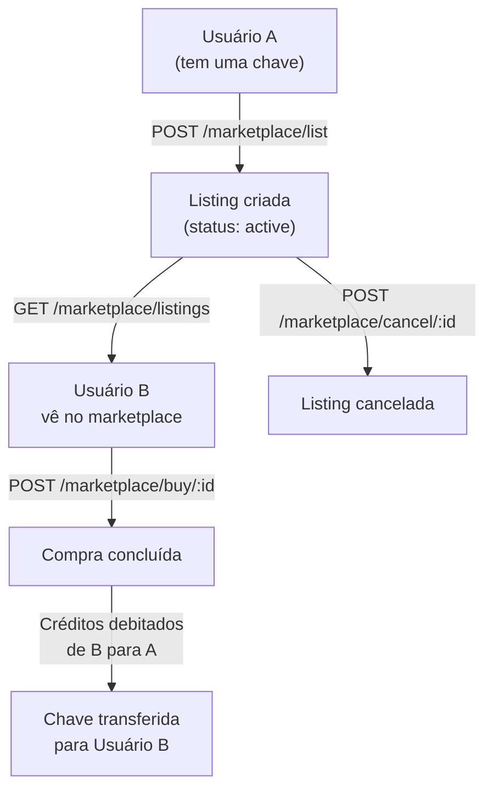

# Marketplace P2P

O marketplace permite que usuários revendam suas chaves (keys) entre si, criando um mercado secundário.

## Fluxo completo



## Listar uma chave para venda

```bash
curl -X POST https://api.mk.nearx.com.br/marketplace/list \
  -H "Authorization: Bearer <token_usuario_a>" \
  -H "Content-Type: application/json" \
  -d '{
    "transactionId": "uuid-da-transacao-original",
    "price": 7500
  }'
```

```json
{
  "id": "listing-uuid",
  "status": "active",
  "price": 7500,
  "sellerEmail": "vendedor@email.com",
  "campaignId": "campaign-uuid",
  "created_at": "2025-01-15T10:00:00Z"
}
```

:::note
`price` é em centavos. R$ 75,00 = `7500`.
O vendedor precisa ter a chave (Transaction) antes de poder listá-la.
:::

## Explorar o marketplace

```bash
# Listar todos os listings ativos
curl https://api.mk.nearx.com.br/marketplace/listings \
  -H "Authorization: Bearer <token>"

# Filtrar por campanha
curl "https://api.mk.nearx.com.br/marketplace/listings?campaignId=uuid&minPrice=5000&maxPrice=20000" \
  -H "Authorization: Bearer <token>"
```

**Parâmetros de busca:**

| Parâmetro | Tipo | Descrição |
|-----------|------|-----------|
| `search` | string | Busca por nome da campanha |
| `campaignId` | uuid | Filtrar por campanha |
| `minPrice` | number | Preço mínimo (centavos) |
| `maxPrice` | number | Preço máximo (centavos) |
| `sortBy` | string | Ordenação (`price_asc`, `price_desc`, `newest`) |

## Comprar uma chave

```bash
curl -X POST https://api.mk.nearx.com.br/marketplace/buy/{listingId} \
  -H "Authorization: Bearer <token_usuario_b>"
```

O sistema automaticamente:
1. Verifica se o comprador tem créditos suficientes
2. Debita os créditos do comprador
3. Credita o vendedor
4. Transfere a propriedade da chave
5. Marca o listing como `sold`

```json
{
  "success": true,
  "transaction": {
    "id": "nova-transaction-uuid",
    "buyerEmail": "comprador@email.com",
    "price": 7500
  }
}
```

## Gerenciar meus listings

```bash
# Ver meus listings
curl https://api.mk.nearx.com.br/marketplace/my-listings \
  -H "Authorization: Bearer <token>"

# Cancelar um listing
curl -X POST https://api.mk.nearx.com.br/marketplace/cancel/{listingId} \
  -H "Authorization: Bearer <token>"
```

## Status dos listings

| Status | Descrição |
|--------|-----------|
| `active` | Disponível para compra |
| `sold` | Vendido com sucesso |
| `cancelled` | Cancelado pelo vendedor |

## Restrições

- Usuário só pode listar chaves que **ele possui** (suas Transactions)
- Chave já listada não pode ser listada novamente
- Comprador não pode comprar sua própria chave
- Créditos do comprador devem ser suficientes para cobrir o preço
