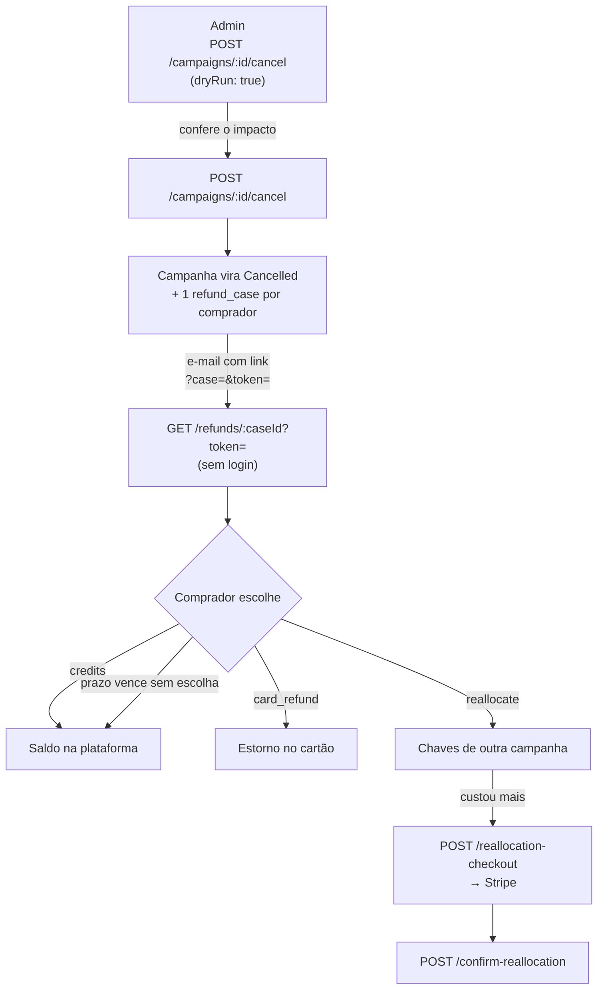

# Reembolso de campanha cancelada

Quando uma campanha é cancelada, cada comprador de chave ganha um **caso de reembolso** e escolhe como quer receber de volta. Este guia é o contrato completo para quem for construir a tela do comprador.

:::info Cancelar não é apagar
`DELETE /campaigns/:campaignId` recusa com **400 `CAMPAIGN_HAS_SOLD_KEYS`** assim que existe uma chave paga. Apagar destruiria o `payment_intent` do Stripe, que só existe dentro do JSON de `transactions.memo` — sem ele nenhum estorno é possível. O cancelamento preserva tudo: a campanha vai para o status **`Cancelled`** (terminal) e as chaves ficam na base como prova do direito ao reembolso.
:::

## Fluxo completo



## Autenticação: a tela do comprador não tem login

Quem chega vem do link do e-mail e **não está logado**. A autorização é o `token` da querystring, que vale só para aquele caso.

- `GET /refunds/:caseId` aceita `?token=`
- `POST /refunds/:caseId/choose` aceita o `token` no corpo **ou** na query
- O mesmo vale para `reallocation-checkout` e `confirm-reallocation`

O token é credencial: não logue, não coloque em analytics, não exiba na tela.

## Valores estão em CENTAVOS

Todo campo monetário deste domínio é inteiro em centavos — `50000` é R$ 500,00. Converta só na renderização.

```ts
const formatCents = (cents: number) =>
  new Intl.NumberFormat('pt-BR', { style: 'currency', currency: 'BRL' })
    .format(cents / 100);
```

Invariante garantida pelo servidor: **`cardAmount + creditAmount === totalAmount`**, sempre.

## As três opções

`POST /refunds/:caseId/choose` com `{ choice, token }`. **A escolha é definitiva** — diga isso na tela antes, não depois.

| `choice` | Exige | O que acontece |
|---|---|---|
| `credits` | — | O valor inteiro vira saldo na plataforma, sem validade |
| `card_refund` | `method: "card"` | Estorna a parcela elegível; o resto vira crédito no mesmo ato |
| `reallocate` | `items[]` | Troca por chaves de outra campanha; sobra vira crédito, falta é cobrada |

### Métodos indisponíveis aparecem — não somem

`options.immediateRefund[]` lista cada método com `enabled` e `unavailableReason`. Renderize o botão **visível e desabilitado**, com o motivo. Esconder faz o usuário procurar uma opção que o produto decidiu não oferecer agora.

Hoje, em todos os ambientes:

- **`card`** — desligado. O reembolso sai em crédito na plataforma. Tentar mesmo assim devolve **422 `CARD_REFUND_UNAVAILABLE`**.
- **`pix`** — desligado, integração com a Asaas não concluída. Devolve **422 `PIX_UNAVAILABLE`**.

Consulte sempre `enabled` antes de habilitar o botão; não hardcode a regra.

## Prazo

`expiresAt` é o limite para escolher — 30 dias a partir da abertura. Vencido, o valor vira crédito automaticamente. `defaultOnExpiry` diz o que acontecerá (hoje sempre `credits`) para a tela avisar sem hardcodar.

## Estados do caso

Só **`pending`** aceita escolha. Os demais (`processing`, `awaiting_payment`, `resolved`, `partially_failed`) devolvem **409** em `choose` — a tela deve mostrar o estado em vez de oferecer as opções de novo.

## Códigos de erro estáveis

Trate pelo campo `error`, nunca pelo texto da mensagem:

| Código | HTTP | Significado |
|---|---|---|
| `CARD_REFUND_UNAVAILABLE` | 422 | Devolução no cartão desligada |
| `PIX_UNAVAILABLE` | 422 | PIX não integrado |
| `NOT_CARD_REFUNDABLE` | 422 | Nada deste valor foi pago no cartão |
| `CASE_PROCESSING` | 409 | Outra requisição está resolvendo o caso |
| `CASE_RESOLVED` | 409 | Já resolvido; a escolha é definitiva |
| `CASE_EXPIRED` | 409 | Prazo vencido |
| `TOPUP_REQUIRED` | 409 | O cesto custa mais e a diferença não foi paga |

## Troca por chaves (`reallocate`)

Mande `items: [{ campaignId, accessId, quantity }]`. **O preço é derivado do tier no servidor** — não existe campo de preço no corpo, de propósito.

- Custou menos: a sobra vira crédito, resolvido na hora.
- Custou mais: a resposta vem com `checkoutRequired: true` e `shortfallAmount`. Chame `POST /refunds/:caseId/reallocation-checkout` com `successUrl`/`cancelUrl`, redirecione para o `checkoutUrl` do Stripe e confirme depois com `POST /refunds/:caseId/confirm-reallocation` mandando o `sessionId`. Nada é emitido antes da confirmação.

## Depois do crédito: a devolução em dinheiro (recompra por PIX)

Quem escolheu `credits` (ou foi convertido pelo prazo) pode pedir que a plataforma **compre de volta** os créditos e pague por PIX **no CPF cadastrado** — é a tela "Solicitar devolução de créditos" do app.

:::caution Não é saque automático
Ainda não existe BaaS com PIX. O pedido entra em análise (5 a 10 dias úteis), a operação paga por fora e registra o resultado. O que a API garante é a contabilidade: **o valor pedido fica travado** (`lockedBalance`) enquanto o pedido está em análise, é consumido quando marcado como pago e volta ao saldo quando recusado ou cancelado.
:::

Antes de mostrar o botão, leia o bloco `buyback` de `GET /credits/balance`:

```json
{
  "balance": 200000,
  "lockedBalance": 75000,
  "available": 125000,
  "buyback": {
    "enabled": true,
    "unavailableReason": null,
    "minAmount": 500,
    "maxAmount": 125000,
    "pixKey": { "type": "cpf", "masked": "390.***.***-**" },
    "analysisBusinessDays": { "min": 5, "max": 10 },
    "pendingRequest": null
  }
}
```

- `enabled: false` vem com o motivo pronto em `unavailableReason` — renderize o botão cinza, não o esconda. Os três motivos, na ordem em que o servidor checa: conta sem CPF, pedido já em análise (`pendingRequest` preenchido), saldo disponível abaixo do mínimo.
- `pixKey.masked` é o CPF **mascarado pelo auth-service** (`cpf_masked` em `GET /auth/profile`). O documento inteiro não existe no admin-backend — a tela mostra a máscara e o usuário não digita chave nenhuma: a recompra vai exclusivamente para o CPF cadastrado.
- `minAmount`/`maxAmount` em **centavos** (1 crédito = 100). A tela pede "quantidade de créditos"; multiplique por 100.

| Método | Rota | O que faz |
|---|---|---|
| `POST` | `/credits/buyback-requests` | `{ amount }` em centavos. Trava o valor e abre o pedido (`pending_review`). Um por vez. |
| `GET` | `/credits/buyback-requests/me` | Acompanhamento: status, observação da análise, referência do PIX quando pago. |
| `POST` | `/credits/buyback-requests/{id}/cancel` | Desistir enquanto em análise — o valor volta ao disponível. |
| `GET` | `/credits/buyback-requests` | Admin: fila (filtre `status=pending_review`). |
| `POST` | `/credits/buyback-requests/{id}/reject` | Admin: recusa com `note` (mostrada ao usuário); destrava. |
| `POST` | `/credits/buyback-requests/{id}/mark-paid` | Admin: PIX pago por fora; consome os créditos. Irreversível. |

Códigos estáveis no campo `error`: `PIX_KEY_MISSING` (422), `BUYBACK_PENDING_EXISTS` (409), `BUYBACK_NOT_PENDING` (409), `BUYBACK_BELOW_MINIMUM` (400), `INSUFFICIENT_BALANCE` (400).

## Configuração necessária no backend

O link do e-mail é montado a partir de `REFUND_PAGE_URL_BASE`. Sem ela o servidor cai num default `http://localhost:3000/reembolso` e o link sai apontando para a máquina de quem gerou — o e-mail parece correto e não leva a lugar nenhum.

```env
REFUND_PAGE_URL_BASE=https://app.homolog.mykeys.club/reembolso
RESEND_API_KEY=
MAIL_FROM_EMAIL=
MAIL_FROM_NAME=MintVRS
```

Sem `RESEND_API_KEY` nenhum e-mail sai. Nesse caso a resposta do cancelamento traz `mailConfigured: false` e um `debugLink` por caso, para envio manual — o campo some sozinho quando a chave existir.

### `APP_ENV` e o PIX simulado

A imagem Docker fixa `NODE_ENV=production` também na homologação, então as ferramentas de teste não podem depender dele. O backend lê **`APP_ENV`** (`development` | `test` | `homolog` | `production`): só fora de `production` o PIX simulado (`OFFER_FUNDING_PIX_SIMULATED_ENABLED=true`) e a validade em minutos ligam. Ausente, `APP_ENV` deriva do `NODE_ENV`; um valor desconhecido é tratado como `production`. Na homolog: `APP_ENV=homolog`. As telas descobrem o que está ligado em `GET /gateways/checkout/capabilities` (compra de chave nova) e `GET /marketplace/offers/capabilities` (revenda).

## Referência das rotas

| Método | Rota | Quem usa |
|---|---|---|
| `POST` | `/campaigns/{campaignId}/cancel` | Admin (aceita `dryRun`) |
| `GET` | `/refunds/{caseId}` | Comprador, via link do e-mail |
| `POST` | `/refunds/{caseId}/choose` | Comprador |
| `POST` | `/refunds/{caseId}/reallocation-checkout` | Comprador |
| `POST` | `/refunds/{caseId}/confirm-reallocation` | Comprador |
| `GET` | `/refunds/me` | Comprador logado |
| `GET` | `/refunds` | Admin |
| `POST` | `/refunds/{caseId}/retry` | Admin (caso `partially_failed`) |
| `POST` | `/refunds/sweep-expired` | Ops |

O contrato completo de cada uma, com schemas e exemplos, está em **API Reference → Admin Backend → refunds**.
