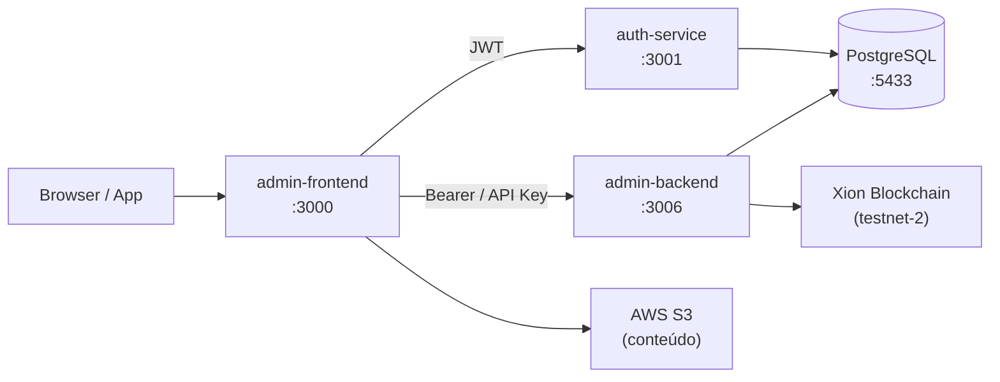

# My Keys Club — Documentação

**MKClub** é uma plataforma multi-tenant de crowdfunding criativo com NFTs na blockchain Xion. Artistas e criadores lançam campanhas e distribuem acesso exclusivo por meio de chaves (tokens) que podem ser adquiridos por apoiadores.

## Serviços

| Serviço | Porta (local) | Descrição |
|---------|--------------|-----------|
| **admin-backend** | `3006` | API REST principal — multi-tenant, pagamentos, blockchain |
| **auth-service** | `3001` | Autenticação, JWT, reset de senha |
| **admin-frontend** | `3000` | Painel administrativo e marketplace (Next.js) |

## Principais funcionalidades

- **Campanhas NFT** — Criadores configuram campanhas com tiers de acesso, preços e conteúdos exclusivos
- **Marketplace P2P** — Usuários revendem suas chaves entre si
- **Sistema de Créditos** — Moeda interna da plataforma; compra via Stripe/Mercado Pago
- **Splits de Receita** — Distribuição automática de receita entre artistas e plataforma
- **Blockchain Xion** — NFTs e tokens CW20 na rede Xion (Cosmos)
- **Multi-tenant** — Uma instância do backend serve múltiplos tenants isolados

## Arquitetura rápida



## Como navegar esta documentação

- **Arquitetura** — Estrutura dos serviços, entidades e decisões de design
- **Autenticação** — Fluxos JWT, API Keys e roles
- **Guias** — Tutoriais passo a passo para as funcionalidades principais
- **API Admin** — Referência completa dos endpoints do admin-backend (com playground)
- **API Auth** — Referência completa dos endpoints do auth-service (com playground)
- **Ambiente & Deploy** — Setup local, variáveis de ambiente e deploy em produção

## Tecnologias

```
Backend:      NestJS v11 · TypeORM · PostgreSQL · Passport JWT · Stripe
Auth:         NestJS v10 · JWT · Nodemailer
Frontend:     Next.js 16 · React 19 · Tailwind CSS v4 · shadcn/ui
Blockchain:   Xion (Cosmos) · CosmWasm · CW20 · CW721 (NFT)
Infra:        Docker · Traefik · AWS S3 · GitHub Container Registry
```
